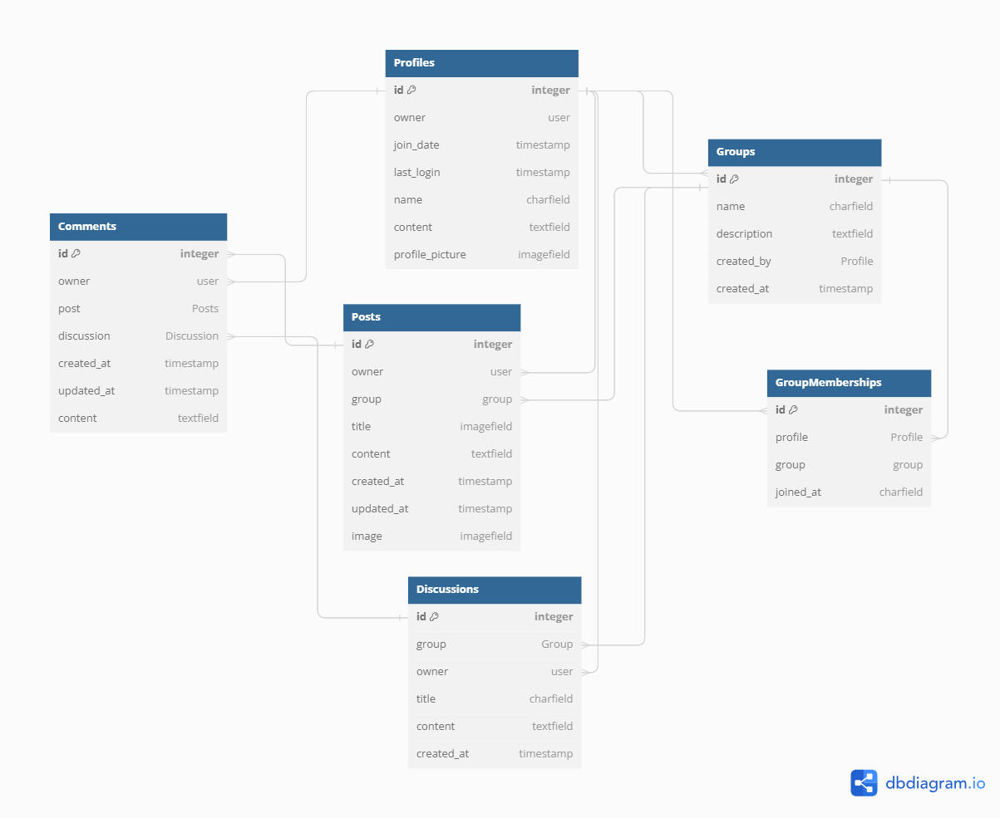

# Group Pix

Group Pix is a social networking platform that provides a dynamic space for photography enthusiasts to create, share and connect within selected groups. Group Pix simplifies the process of sharing the users finest photographic moments while fostering interactions with like-minded individuals who share the same interests, locations, or event experiences. 

 This a fictional website created as a milestone project for Code Institutes fullstack developer course.

## User Experience (UX)

Users can create groups centered around specific interests, locations, or events, allowing them to connect with others who share their passions.

##  Strategy Plan

### Project Goals

### User Goals

- As a user I want to upload, edit or delete a photo.
- As a user I want to join or leave a group.
- As a user I want to create my own photography groups based on my interests or experiences.
- As a user I want to like, unlike or comment on a photo.
- As a user I want to discover groups that align with my interests, locations, or event experiences.
- As a user I want to showcase my photography skills and share my best images with a receptive audience.
- As a user I want to engage in discussions, offer feedback, and exchange insights with other users.

### User Expectations

- Users expect an easy-to-navigate interface that allows them to quickly find photography groups, upload images, and engage in discussions.
-  Users expect a platform that works seamlessly across devices, enabling them to engage with photos and discussions from anywhere.
- Users expect that their personal information and photos will be safe, ensuring a trustworthy and secure platform.

### User Stories

### Scope

#### EPIC:

##### User Stories

## Structure

### Database Model

To create the entity relationship diagram, I used [dbdiagram](https://dbdiagram.io/home). It shows the relationship between all models in the database.

### Database

For this project I used a PostgreSQL database hosted by [ElephantSQL](https://www.elephantsql.com/). 

### Models

#### Profiles :

| Database Value | Field Type     | Field Argument                 |
|----------------| ---------------| -------------------------------|
| owner          | ForeingKey     | User, on_delete=models.CASCADE |
| join_date      | DateTimeField  | auto_now_add=True              |
| last_login     | DateTimeField  | auto_now=True                  |
| name           | CharField      | max_length=255, blank=True     |
| content        | TextField      | blank=True                     | 
|  profile_picture |ImageField    | upload_to='images/', default='../default_profile_eianob' |

#### Groups :

| Database Value | Field Type     | Field Argument                 |
|----------------| ---------------| -------------------------------|
| name           |  CharField     | max_length=255                 |
| description    |  TextField     |                                |
| members        | ManyToManyField| User, through='GroupMembership', related_name='group_memberships'|
| created_by     | ForeignKey     | User, on_delete=models.CASCADE, related_name='created_groups |
| created_at     | DateTimeField  | auto_now_add=True | 

#### Posts :

| Database Value | Field Type     | Field Argument                 |
|----------------| ---------------| -------------------------------|
| owner          | ForeignKey     | User, on_delete=models.CASCADE |
| group          | ForeignKey     | Group, on_delete=models.CASCADE |
| title          | CharField      | max_length=255                 |
| content        | TextField()    |                                |
| created_at     | DateTimeField  | auto_now_add=True              |
| updated_at     | DateTimeField  | auto_now=True                  |
| image          | ImageField     |  upload_to='images/', default='../default_post_e3pet6.jpg', blank=True |

#### Discussions :

| Database Value | Field Type     | Field Argument                 |
|----------------| ---------------| -------------------------------|
| group          | ForeignKey    | Group, on_delete=models.CASCADE |
| owner          | ForeignKey    | User, on_delete=models.CASCADE  |
| title          | CharField     | max_length=255                  |
| content        | TextField()   |                                 |
| created_at     | DateTimeField | auto_now_add=True               |

#### Comments :

| Database Value | Field Type     | Field Argument                 |
|----------------| ---------------| -------------------------------|
| owner          | ForeignKey     | User, on_delete=models.CASCADE |
| post           | ForeignKey     | Post, on_delete=models.CASCADE, related_name='posts' null=True, blank=True |
| discussion     | ForeignKey     | Discussion, on_delete=models.CASCADE, related_name='comments' null=True, blank=True |
| created_at     | DateTimeField  | auto_now_add=True |
| updated_at     | DateTimeField  | auto_now=True content = models.TextField() |

## Skeleton

### Wireframes

## Surface

## Features

### Design

### Color Scheme

### Existing Features

### Future Features

## Testing

All testing information can be found here [testing.md](https://github.com/moolleer/p5-group-pix/blob/main/docs/testing.md)

## Deployment

## Credits & Content

### Media

## Project Acknowledgements
