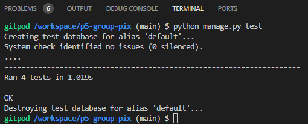

## Testing

### Group Pix API

#### Manual Testing

All tests done have passed.

Tests:

Profile: 

- A user who is not signed in can't access Profiles in Profile List or Profile Detail.
- A logged in user can access profiles in Profile List and a single profile in Profile Detail.
- A user that is not the owner of a profile cant edit or delete a profile.
- A owner of a profile can edit the title, content and change image.
- A user can delete their account and all its content.

Post:

- A user who is not signed in cant access posts in Post List and Post Detail.
- A logged in user can acces posts for a group in Post List and Post Detail.
- A logged in user who is not a member of the group or a group creator cant create a post.
- Only a post owner can edit the posts title, content, image, and delete the post.
- A user cant upload an image with a file size bigger than two megabytes or height or width bigger than 4096 pixels.
- A user can search for posts by the owners username, title or content. 
- Posts can also be filtered by its owner to display only posts created by a specific user. 

Groups:

- A user who is not signed in cant access groups in Groups List or Group Detail.
- A logged in user can acces groups in the Groups List and a single group in Group Detail.
- Only a logged in user can create a group.
- Only a group creator can edit or delete a group.
- Only a logged in user can join or leave a group.
- A user can search for groups by its name, groups created by a specific user and the description.
- Groups can also be filtered by number of members.

Discussions:

- A user who is not signed in cant access discussions in Discussion List or Discussion Detail.
- A user who is a member of the group can acces discussions in the Discussion - List and a single discussion in Discussion Detail.
- Only a group member or owner can create a discussion.
- Only a group creator can edit or delete a discussion.
- Only a member or group creator can access discussions in Discussions List and a discussion in Discussion Detail.
- A user can search for discussions by the owners username, title or content. 
- Discussions can also be filtered by its owner to display only discussions created by a specific user

Comments:

- Only a member or group creator can access comments in Comments List and comments in Comment Detail.
- Only a comment owner can edit or delete a comment.

#### Automated Tests

Due to time constrains I decided to write some tests for posts app.
Following tests have been written for the posts app:

- PostCreateTests, Test Case Setup:
In the test case setup, you create users, a group, a member user, and a group membership for testing.

- test_user_not_logged_in_cant_create_post:
This test checks that a user who is not logged in should not be able to create a new post.
It sends a POST request to the "post-create" endpoint with the post data.
It expects a response with a status code 403 (FORBIDDEN) since the user is not authenticated.

- test_user_not_member_cant_create_post:

This test checks that a user who is not a member of the group should not be able to create a new post.
It logs in a different user ("testuser2") who is not a member of the group.
It sends a POST request to the "post-create" endpoint with the post data.
It expects a response with a status code 403 (FORBIDDEN) since the user is not a member of the group.

- test_create_post_as_member:
This test checks that a member of the group should be able to create a new post.
It logs in the member user.
It sends a POST request to the "post-create" endpoint with the post data.
It expects a response with a status code 201 (CREATED) indicating successful creation.

- test_create_post_as_creator:
This test checks that the creator of the group should be able to create a new post.
It logs in the user who created the group.
It sends a POST request to the "post-create" endpoint with the post data.
It expects a response with a status code 201 (CREATED) indicating successful creation.

#### Code Validation
##### PEP8

The Group Pix API has been passed through the internal PEP8 validation tests which I installed into GitPod. The method I used to do this was as per the Slack Article written by kevin_ci on the 28th September 2022 in #announcements:

1. Run the command 'pip3 install pycodestyle'. Note that this extension may already be installed.
2. Press Ctrl+Shift+P in your workspace (or Cmd+Shift+P on Mac)
3. Type 'linter' into the search bar that appears.
4. Select 'Python: Select Linter
5. Select 'pycodestyle' from the list
6. PEP8 errors are now displayed in the PROBLEMS tab beside your terminal and underlined in red.

#### Group_pix 
- permissions.py - No problems or warnings found
- serializers.py - No problems or warnings found
- urls.py - No problems or warnings found
- views.py - No problems or warnings found

#### Comments App
- models.py - No problems or warnings found
- serializers - No problems or warnings found
- urls.py - No problems or warnings found
- views.py - No problems or warnings found

#### Discussions App
- models.py - No problems or warnings found
- serializers - No problems or warnings found
- urls.py - No problems or warnings found
- views.py - No problems or warnings found

#### Groups App
- models.py - No problems or warnings found
- serializers - No problems or warnings found
- urls.py - No problems or warnings found
- views.py - No problems or warnings found

#### Posts App
- models.py - No problems or warnings found
- serializers - No problems or warnings found
- tests.py - No problems or warnings found
- urls.py - No problems or warnings found
- views.py - No problems or warnings found

#### Profiles App
- models.py - No problems or warnings found
- serializers - No problems or warnings found
- urls.py - No problems or warnings found
- views.py - No problems or warnings found

### Frontend

#### Code validation

#### Lighthouse

#### W3C Validator Tools

CSS

### Bugs

- I had a problem with my favicon not displaying in the Google Chrome browser. I tried to delete and replace the original favicon but it didnt help. At last I found an helpful thread on [StackOverflow](https://stackoverflow.com/questions/16375592/favicon-not-showing-up-in-google-chrome) that solved it.
- The profile picture did not show up in the navbar. After some troubleshooting I found out that I forgot to change the variable names in group_pix serializers, I had stated profile_image instead of profile_picture.

#### Unsolved Bugs

Due to time constrains this bug have not been solved yet:
- It is possible to become a member of a group even if you are the creator of the group

